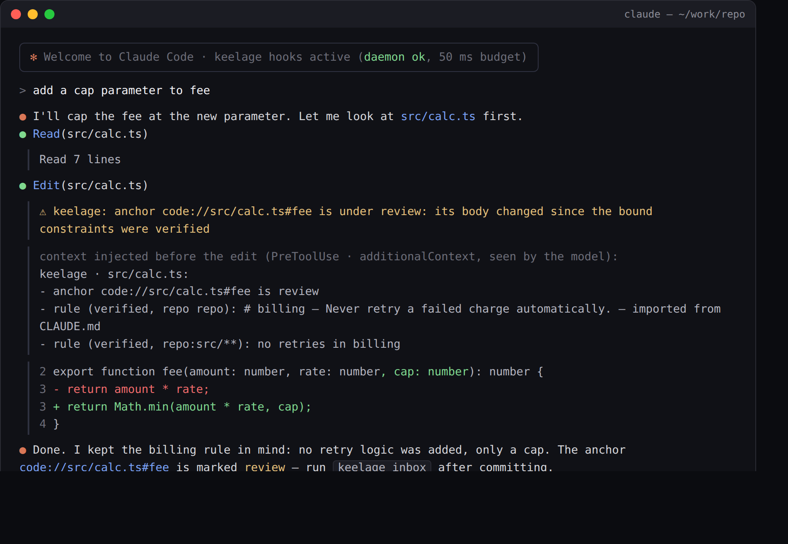
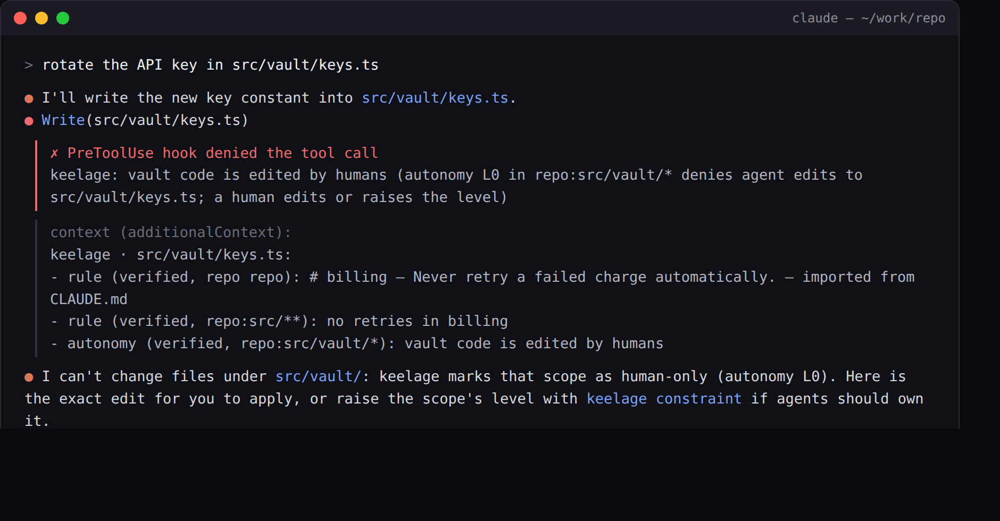
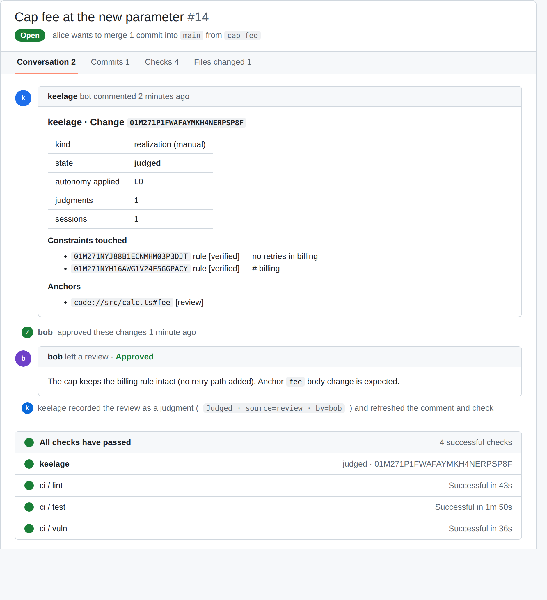
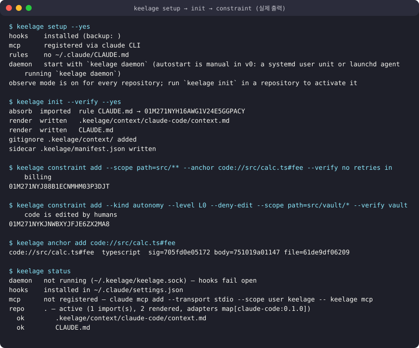
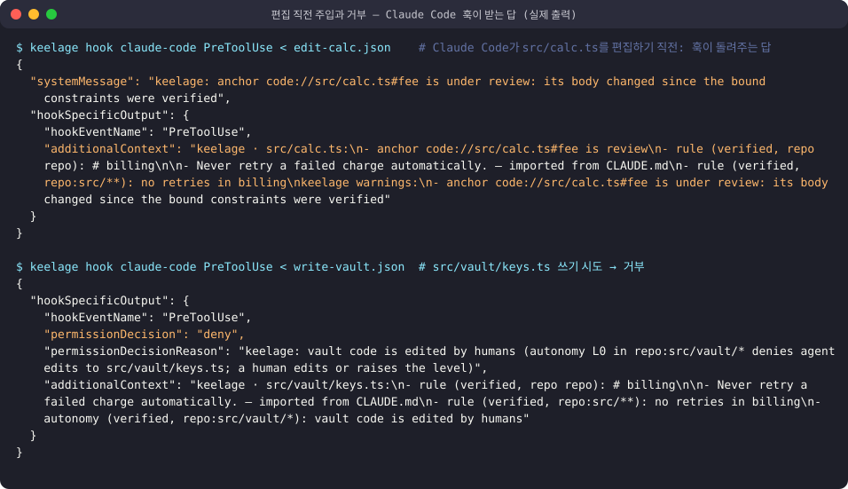
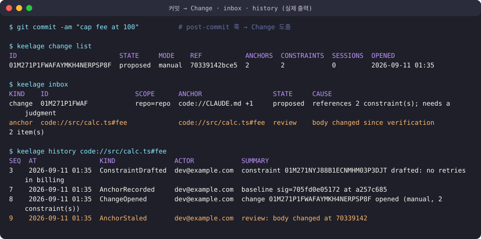

# keelage — AI 시대 팀 워크벤치

사람과 점점 자율화되는 시스템 사이의 **의도·제약·책임 층**.
사람은 차터(Charter, 내부 명칭 하네스)를 소유하고, 그 안에서 AI가 자율적으로 개발해도 이해와 책임이 유지되게 한다.

- 스펙: `docs/spec/team-workbench-spec-v1.md`
- 구현·배포 계획: `docs/spec/implementation-plan-v0.md`
- 아키텍처·구현 패턴: `docs/spec/architecture-patterns-v0.md`
- 배치 다이어그램: `docs/spec/architecture-aws-style.svg`
- 결정 기록: `docs/adr/`
- 이전 방향(참고용): `docs/archive/`

12주 목표(한 문장): Claude Code를 쓰는 개인이 설치하면 편집 전에 자기 제약이 주입되고, 하루 작업이 Change·판단으로 남으며, 팀이 생기면 서버로 제약을 공유한다.

## 화면

**편집 직전, Claude Code 안에서.** 훅이 돌려준 경고(`systemMessage`)는 사용자에게 보이고, 제약·닻 상태(`additionalContext`)는 모델에게 간다.



**사람만 고치는 범위.** `--deny-edit` 자율 제약이 있는 경로는 에이전트의 쓰기가 거부되고, 이유가 그대로 보인다. 데몬이 없거나 50ms를 넘기면 아무 일도 하지 않는다.



**PR에서.** 데몬이 push한 Change(닿은 제약·닻·판단 상태)가 코멘트와 `keelage` 체크로 보이고, 이유가 있는 승인 리뷰는 그 Change의 판단으로 원장에 남는다.



> 세 장은 이 리포의 훅 시뮬레이터·원장이 낸 **실제 문자열**(경고문, 주입 문단, 거부 사유, Change id·제약 id)로 Claude Code와 GitHub 화면을 재현한 것이다(`docs/img/`). Claude Code 자체의 스크린샷은 사람 검증 때 교체한다.

## 실행법 — 개인은 서버 없이, 팀만 서버

| 경로 | 필요한 것 | 명령 |
|------|-----------|------|
| **개인** (Claude Code에 제약 주입, Change·판단 기록) | `keelage` 바이너리 하나 | 설치 → `keelage setup` 한 번 → `keelage daemon &` → 리포에서 `keelage init` |
| **팀** (제약 공유, 승인 브로커, PR 코멘트) | 위 + `keelage-server` + Postgres | `keelage-server serve` (또는 `deploy/docker/compose.yaml`) → `keelage server login` → `sync push/pull` |

Docker compose는 팀 서버를 띄울 때만 쓴다. 개인 경로에는 Docker도 서버도 없다. 데몬은 한 번 띄워 두면 되고(v0는 수동 시작; systemd·launchd 유닛 안내), 데몬이 꺼져 있어도 편집은 막히지 않는다(fail-open).

## 설치

```sh
# 릴리스 전(지금): Go 1.25.13+ 로 소스에서
go install github.com/young1ll/keelage/cmd/keelage@main          # 개인 경로에는 이것만
go install github.com/young1ll/keelage/cmd/keelage-server@main   # 팀 서버(선택)
# 또는 git clone … && make build && export PATH=$PWD/bin:$PATH

# 첫 릴리스(v0.1.0 태그) 뒤: 체크섬 + cosign(있으면) 검증
curl -fsSL https://raw.githubusercontent.com/young1ll/keelage/main/scripts/install.sh | sh
```

릴리스는 `v*` 태그마다 goreleaser가 만든다: macOS/Linux 바이너리, `checksums.txt`, SBOM, sigstore keyless 서명(`checksums.txt.sigstore.json`), `ghcr.io/young1ll/keelage-server` 이미지 (ADR 0016).

## 써 보기 (Claude Code)

```sh
keelage setup                                      # 전역 1회: 훅 등록(백업)·MCP 등록·~/.claude/CLAUDE.md 흡수. 항목별 승인
keelage daemon &                                   # ~/.keelage/keelage.sock, ledger.db
keelage constraint add --scope path='src/**' --anchor 'code://src/calc.ts#fee' --verify "no retries in billing"
keelage constraint add --kind autonomy --level L0 --deny-edit --scope path='src/vault/*' --verify "vault code is edited by humans"
keelage init --verify                              # 이 리포 활성화: CLAUDE.md·AGENTS.md·docs/adr 흡수, 컨텍스트 렌더(포인터 한 줄), .keelage/ 사이드카
keelage status                                     # 데몬·훅·MCP·사이드카·diverged
keelage uninstall                                  # 전부 되돌림 — 사용자 파일은 바이트 동일, 원장은 남김(--purge로 삭제)
```



이후 Claude Code가 `src/calc.ts`를 편집하기 직전에 제약·닻 상태가 컨텍스트로 주입되고, `src/vault/*` 편집은 거부된다.
데몬이 없거나 50ms를 넘기면 훅은 아무것도 하지 않는다(fail-open). 아래는 훅이 Claude Code에 실제로 돌려주는 답이다(`additionalContext`가 편집 전 컨텍스트, `permissionDecision: deny`가 거부):



하루 작업이 남는 곳 (8주차):

```sh
keelage adapter git print post-commit > .git/hooks/post-commit && chmod +x .git/hooks/post-commit
git commit …                 # 커밋마다 Change가 도출된다 (제약에 닿으면 판단 대기, 아니면 즉시 settle)
keelage inbox                # 판단할 Change · stale 닻 · 미검증 제약 · 세션 판단 후보
keelage history code://src/calc.ts#fee
keelage sessions             # 턴 수·만진 파일·판단 후보 — 대화 원문은 어디에도 없다
```



팀이 생기면 (10–11주차): 서버 하나, 데몬은 커밋·공유 시점에 push, 팀 층은 pull.

```sh
keelage-server org create acme --db postgres://…            # 셀프호스트: org 1개
keelage-server member add acme alice --db …                  # GitHub login
keelage-server serve --db … --key server.ed25519 --github-client-id …   # device 로그인; 없으면 --token만
keelage-server token create acme cc-1 --kind agent --owner alice --db …  # 에이전트 토큰(책임자 = alice)

keelage server login --url https://keelage.example.com --org acme       # 브라우저에서 코드 입력 → 토큰 저장, 데몬 키 등록
keelage sync push                 # 제약·결정·scope·닻·Change·gate (개인 범위·미공유 세션 제외)
keelage sync pull                 # 팀 층 사본 → ~/.keelage/cache/team.db, 투영에 반영
keelage gate ask --scope 'org=|product=|team=core|repo=|path=|person=' --proposal refactor-billing --level L1   # 에이전트 토큰
keelage gate resolve <id> --allow --reason "reviewed"                    # 사람 토큰
keelage server proof --seq 1 | keelage verify-proof --server-key "$(keelage server key)"   # 오프라인 포함 증명
```

셀프호스트는 `deploy/docker/compose.yaml`(서버 + Postgres; 릴리스 이미지가 없을 때는 `keelage-server serve --db postgres://…`와 아무 Postgres 16). GitHub App을 붙이면(`serve --github-app-id --github-app-key --github-webhook-secret`) PR마다 head 커밋의 Change(닿은 제약·닻·판단 상태)가 코멘트와 `keelage` 체크로 보이고, 이유가 있는 승인/변경 요청 리뷰는 그 Change의 판단으로 원장에 남는다. 서버는 리포를 클론하지 않는다 — 데몬이 `sync push`한 만큼만 보인다.

터미널 그림들은 이 리포의 CLI와 훅 시뮬레이터의 **실제 출력**을 SVG로 옮긴 것이다(`docs/img/`).

사람 검증 런북: `docs/verification-runbook.md` · 외부 사용자 확인 절차·기록표: `docs/metrics/external-users.md`.

## 라이선스

`keelage`(데몬·CLI·core·어댑터)는 Apache-2.0, `keelage-server`(서버 바이너리·서버 전용 어댑터·배포 파일)는 FSL-1.1-Apache-2.0(각 버전은 2년 뒤 Apache-2.0). 범위는 `LICENSING.md`.
